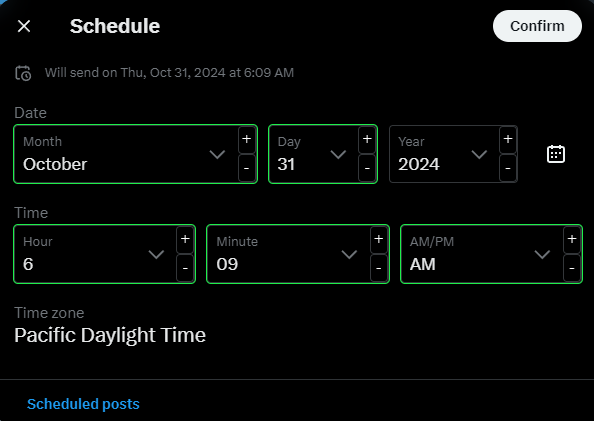

# 𝕏 Schedule Helper

Remembers the previously selected date on 𝕏 for post scheduling and adds dropdown incrementing buttons.
This is really helpful for mass scheduling regular content on 𝕏, save yourself hundreds of clicks!

## Running this extension

1. Clone this repository.
2. Load this directory in Chrome as an [unpacked extension](https://developer.chrome.com/docs/extensions/mv3/getstarted/development-basics/#load-unpacked).
3. Open https://developer.chrome.com.
