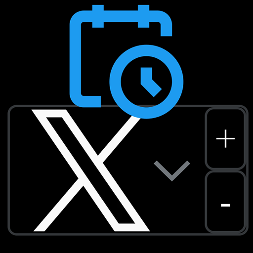
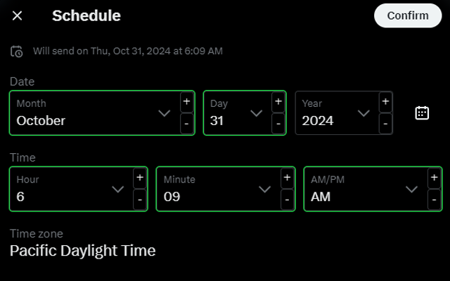
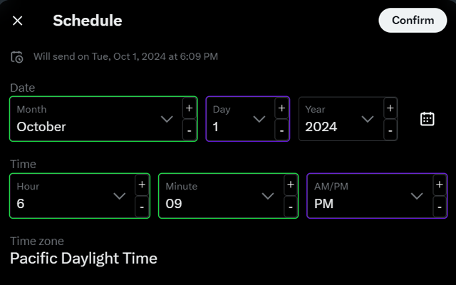

# 𝕏 Schedule Helper - Chrome Extension

𝕏 Schedule Helper is a Chrome extension designed to streamline the post scheduling process on X (formerly Twitter) by automatically remembering and restoring your previously selected scheduling date and time. It reduces repetitive clicks, saving you time when scheduling multiple posts.

### Features:
- **Auto-remembers Scheduling Options**: The extension locally stores the selected scheduling date and time in Chrome’s local storage and automatically restores them when you open the scheduling dialog again.
  - This is really helpful for mass scheduling regular content on 𝕏, save yourself hundreds of clicks!
  - When a value is loaded upon entering the schedule modal, the select input is outlined in green.
- **Increment/Decrement Buttons**: Next to each date selector, the extension adds user-friendly buttons that allow you to easily adjust the scheduling time up or down.
  - When a select input is modified by the increment buttons, it is outlined in purple. 
- **Fully Local and Private**: All data, such as your scheduling preferences, are stored within your browser using Chrome's local storage. No data is transmitted to any external servers, ensuring complete privacy.

The Extension works on x.com and pro.x.com, however it works best for 𝕏 Pro when going straight to this url first: https://pro.x.com/compose/post/schedule (or reloading the page after clicking schedule).

### How It Works:
- The extension listens for changes to the scheduling selectors on the X post scheduling page (`/compose/post/schedule`).
- When a change is detected (e.g., the user selects a different date/time), the selected value is stored in Chrome’s local storage.
- When the scheduling dialog is opened again, the extension retrieves the previously stored value from local storage and sets it as the current value.
- To simulate user interaction, the extension dispatches a `change` event programmatically after restoring the value, ensuring that the X scheduling system registers the change.
- **Additional Buttons**: Increment (`+`) and decrement (`-`) buttons are programmatically inserted next to each scheduling selector to give the user quick access to adjust values.

### Key Technical Details:
- **Content Script** (`remember.js`): The extension’s core logic is executed within a content script that interacts with the X scheduling page’s DOM elements. It observes mutations on the page and ensures that event listeners are only applied once to each selector.
- **Event Listener Management**: The extension uses a `Map` to store event listener references, allowing it to safely remove and reattach listeners as needed to prevent multiple listeners from being added to the same element.
- **Chrome Local Storage**: Scheduling preferences are stored locally using `chrome.storage.local`, allowing the extension to persist settings between sessions while maintaining user privacy.
- **No Background Service Worker**: All operations are handled directly within the content script, simplifying the extension’s architecture and avoiding unnecessary background processes.

### Privacy:
𝕏 Schedule Helper operates entirely within the user's browser and **does not collect, transmit, or share any data**. The extension’s use of Chrome local storage ensures that all user data (such as scheduling preferences) is stored privately and locally, and is not accessible by any external service or server.

### How to Install:

#### Web Store
1. Install the extension from the Chrome Web Store (link will be provided upon publishing).
2. Once installed, navigate to / refresh X and open the post scheduling dialog.
3. The extension will automatically remember your selected scheduling date/time and allow you to adjust values using the added increment/decrement buttons.

#### From the repository

1. Clone this repository.
2. Load this directory in Chrome as an [unpacked extension](https://developer.chrome.com/docs/extensions/mv3/getstarted/development-basics/#load-unpacked).
3. Open https://x.com.

### Contributing:
Feel free to contribute! If you find bugs or want to add features, submit a pull request or open an issue on the GitHub repository.
